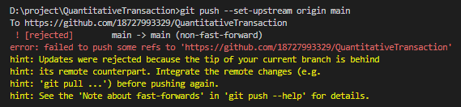

# Git使用

## git常用命令

### git初始化
>git init (在新建项目目录下执行，会生成.git隐藏文件)

### 查看所有远程仓库
>git remote -v

### 查看某远程仓库详情
>git remote show <name>

### 新增远程仓库
>git remote add \<name> \<url> 
```python
#<name>为远程仓库名称
#<url>为远程仓库地址
```

### 删除远程仓库
>git remote remve \<name>

### 修改远程仓库
- 修改远程仓库名称
  >git remote rename \<old> \<new>
- 修改远程仓库地址
  >git remote set-url --add \<name> \<newurl>
- 删除远程仓库地址
  >git remote set-url --delete \<name> \<url>

### 查看分支
- 查看本地分支
  >git branch

- 查看远程分支
  >git branch -r

- 查看所有分支
   >git branch -a

```
D:\project\QuantitativeTransaction>git branch -r
  origin/main
D:\project\QuantitativeTransaction>git branch
* main
  master
D:\project\QuantitativeTransaction>git branch -a
* main
  master
  remotes/origin/main
```
### 新建本地分支并切换到新建分支
>git checkout -b \<name>

`新创建分支的时候：当你新创建分支，或者其他人新创建分支的时候，可以使用git fetch 拉取远程最新分支到本地；此时也可以使用 git remote show origin 查看本地分支和远程分支的差异`

### 删除分支
- 删除本地分支
  > git branch -d <branch_name>

- 删除远程分支
  >git push <remote_name> :<branch_name> 或 git push <remote_name> --delete <branch_name>

<br>
<br>

## 本地git代码推送至远程git仓库步骤：
`如果是新建项目，需先git init初始化，检查远程仓库信息`

1.先检查分支
>git branch

如果分支在master主分支，需要新建1个分支

2.把修改后的代码迁移到新的分支上去
>git checkout -b xxx

3.再次执行
>git branch

查看是否在xxx分支上

4.查看有哪些文件被修改 或 新增了哪些文件 （如有新增或者修改，则这些文件全部<font color=red>红色</font>显示）
>git status

5.把所有的修改操作添加到暂存区
>git add .

6.再次检查状态，看看有没有添加加暂存区（如有，则这些文件全部<font color=green>绿色</font>显示）
>git status

7.提交xxx分支到本地仓库里面 -m 表示提交1个消息通知
>git commit -m "this is a update of xxx."

8.再次检查状态，如果出现“nothing to commit，working tree clean” 表示xxx分支里面的代码已经是最新的了
>git status 

9.把本地仓库的xxx分支推送到远程git仓库（把本地的user分支推送到远程的origin仓库里面）
>git push -u origin xxx

`加参数-u，因为远程还不存在xxx分支`

（如果出现“Branch 'xxx' set up to track remote branch 'xxx' from origin”就表示远程已经推送成功）

10.把所有代码合并到主分支master上面，先检查分支是不是在maste，如果不在，切换到master主分支
切换后，再次检查是否已经切换到master主分支
>git branch<br>git checkout master<br>git branch

11.从主分支master上面把xxx分支上面的代码合并
>git merge xxx

12.把本地的master代码推送到远程端
>git push 

`若报fatal: The current branch main has no upstream branch.To push the current branch and set the remote as upstream...`

```
D:\project\QuantitativeTransaction>git push 
fatal: The current branch main has no upstream branch.
To push the current branch and set the remote as upstream, use

    git push --set-upstream origin main

```

则因当前本地分支未同步到远程分支，执行以下命令
>git push --set-upstream origin <远程仓库分支名>

`出现报错：(non-fast-forward)`

出现(non-fast-forward)的根本原因是repository已经存在项目且不是你本人提交（我知道是大概率你提交的，但是git只认地址），你commit的项目和远程repo不一样。这时该把远端项目拉回本地
>git pull origin main



然而pull回来之后，你再push依旧会fail! 原因是他们是两个不同的项目, 具有不同的提交历史,需要强制合并
>git pull origin main --allow-unrelated-histories

```
D:\project\QuantitativeTransaction>git pull origin main
From https://github.com/18727993329/QuantitativeTransaction
 * branch            main       -> FETCH_HEAD
fatal: refusing to merge unrelated histories
```


